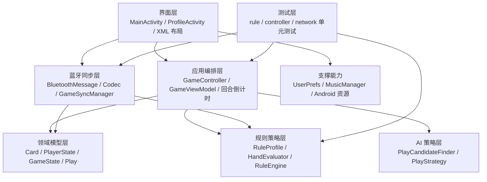
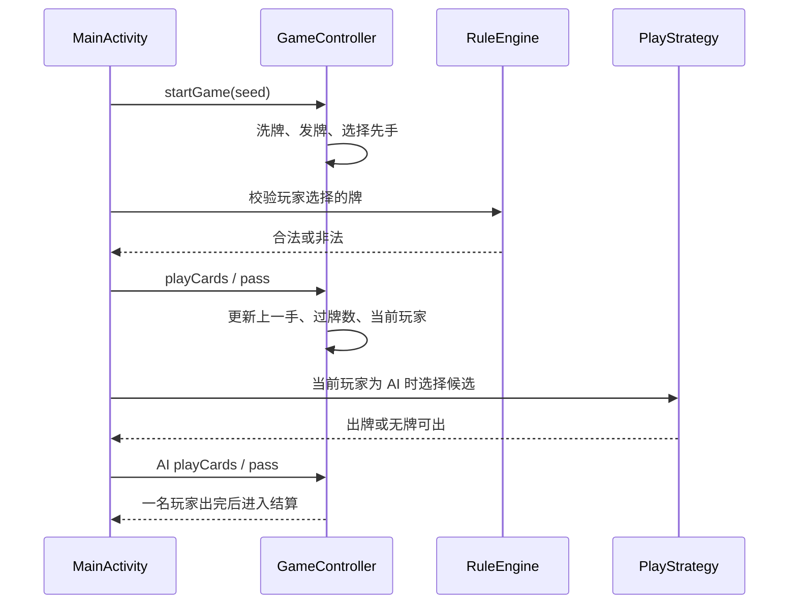
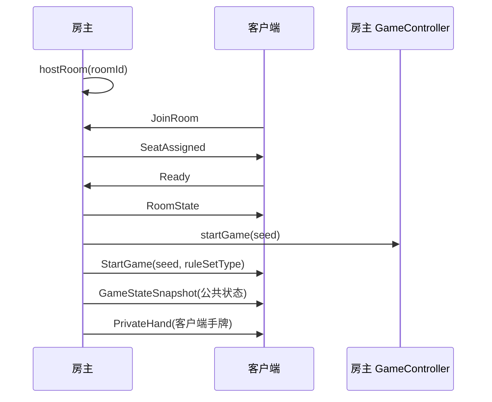

# 项目总体架构说明

本文从系统分层、模块职责、数据流和联机同步角度说明当前锄大地 Android 项目的总体架构，便于课程报告、答辩讲解和后续接手开发。

## 一、系统定位

本项目是一个 Kotlin Android 锄大地多人对战应用，当前版本面向课程演示和实训验收，已实现本地人机对战、南方/北方规则切换、蓝牙房间联机、回合倒计时、背景音乐和个人统计。

系统采用单 Android 应用模块 `app`，入口为 `MainActivity`。界面层负责大厅、房间和牌桌交互，核心牌局逻辑被拆分到 `model`、`rule`、`controller`、`ai` 和 `network` 等包中，避免规则、控制器和蓝牙协议全部耦合在界面代码里。

## 二、技术栈与工程结构

| 类别 | 当前实现 |
| --- | --- |
| 开发语言 | Kotlin |
| 平台 | Android，`minSdk 24`，`targetSdk 34` |
| 构建系统 | Gradle Kotlin DSL，Android Gradle Plugin 8.4.2 |
| UI 技术 | 单 Activity + XML Layout + 动态 View 渲染 |
| 本地测试 | JUnit4 单元测试 |
| 联机方式 | Android Classic Bluetooth RFCOMM socket |
| 本地持久化 | `SharedPreferences` 保存昵称、分数统计、音乐设置 |

主要目录如下：

```text
ChuDaDi---App/
├── app/
│   ├── build.gradle.kts
│   └── src/
│       ├── main/
│       │   ├── AndroidManifest.xml
│       │   ├── java/com/scut/chudadi/
│       │   │   ├── MainActivity.kt
│       │   │   ├── ProfileActivity.kt
│       │   │   ├── UserPrefs.kt
│       │   │   ├── ai/
│       │   │   ├── audio/
│       │   │   ├── controller/
│       │   │   ├── model/
│       │   │   ├── network/
│       │   │   ├── rule/
│       │   │   └── ui/
│       │   └── res/
│       └── test/java/com/scut/chudadi/
├── Documents/
├── build.gradle.kts
└── settings.gradle.kts
```

## 三、总体分层

当前架构可以理解为“界面编排层 + 游戏应用层 + 领域规则层 + 基础能力层”。



### 1. 界面层

界面层主要由 `MainActivity` 和 XML 资源组成。`MainActivity` 当前承担大厅、蓝牙房间、牌桌页面切换，以及玩家选牌、出牌、过牌、提示、倒计时、日志和座位状态渲染等职责。

`ProfileActivity` 负责展示和编辑个人昵称、总局数、总分、胜局和胜率等信息。音乐播放和 UI 音效由 `MusicManager` 与 `SoundPool` 配合实现。

### 2. 应用编排层

应用编排层以 `GameController` 为核心。它不关心具体 Android View，只负责一局游戏的状态推进，包括洗牌发牌、确定先手、出牌、过牌、跳过已结束玩家、记录完成顺序和结算分数。

`MainActivity` 在此基础上补充面向 App 的编排逻辑，例如本地 AI 自动行动、蓝牙主机/客户端职责判断、20 秒倒计时、超时自动出牌或过牌，以及对局结束后的累计比分更新。

### 3. 领域模型层

`model` 包保存游戏的核心数据结构：

| 文件 | 说明 |
| --- | --- |
| `Card.kt` | 定义花色 `Suit`、点数 `Rank` 和可排序的 `Card`。 |
| `HandType.kt` | 定义单张、对子、三条、四炸、顺子、同花五、葫芦、铁支、同花顺等牌型，以及一次出牌 `Play`。 |
| `GameState.kt` | 定义玩家 `PlayerState`、规则类型 `RuleSetType`、计分模式 `ScoringMode`、游戏配置 `GameConfig` 和局面 `GameState`。 |

这些模型是控制器、规则判断、AI 和网络快照共同依赖的基础对象。

### 4. 规则策略层

规则层由 `RuleProfile`、`HandEvaluator` 和 `RuleEngine` 组成。

`RuleProfile` 用策略接口表达南方规则和北方规则的差异：

| 规则差异点 | 南方规则 | 北方规则 |
| --- | --- | --- |
| 首轮要求 | 必须包含方块 3 | 不强制方块 3 |
| 先手选择 | 持有方块 3 的玩家先手 | 上局赢家先手，首局默认 `p1` |
| `A2345` 顺子 | 支持 | 不支持 |
| 同点数比较花色 | 比较 | 不比较 |

`HandEvaluator` 负责把一组牌识别为具体 `Play`，并计算主点数与主花色。`RuleEngine` 负责合法性校验和牌面比较，包括是否属于玩家手牌、首轮限制、牌型是否有效、是否能压过上一手，以及当前是否允许过牌。

### 5. AI 策略层

AI 层先由 `PlayCandidateFinder` 枚举当前手牌中所有合法候选，再由 `PlayStrategy` 选择最终出牌。

当前实现包含两种策略：

| 策略 | 文件 | 行为 |
| --- | --- | --- |
| 贪心策略 | `GreedyStrategy.kt` | 选择排序后最小的合法候选，倾向保留大牌。 |
| 保守/压制策略 | `ConservativeStrategy.kt` | 选择排序后较大的合法候选，倾向更主动压牌。 |

`MainActivity.strategyFor` 当前为不同 AI 座位选择不同策略。后续如果要增加更复杂 AI，可以继续实现 `PlayStrategy`，不用改动 `GameController` 的核心规则推进。

### 6. 蓝牙同步层

`network` 包负责蓝牙联机协议和连接管理：

| 文件 | 说明 |
| --- | --- |
| `BluetoothProtocol.kt` | 定义加入房间、分配座位、准备、开局、出牌、过牌、快照、私人手牌、结算、离线、重连、心跳和错误等消息类型。 |
| `BluetoothMessageCodec.kt` | 将消息编码成按行传输的字符串，并负责 URL 编码、列表、Map 和规则类型解析。 |
| `BluetoothGameSyncManager.kt` | 使用经典蓝牙 RFCOMM socket 创建房间、连接主机、收发消息、维护连接别名和离线通知。 |
| `CardWireCodec.kt` | 将牌转换为适合网络传输的字符串编码，并进行非法值校验。 |
| `BluetoothPermissionHelper.kt` | 封装 Android 蓝牙运行时权限判断。 |

联机设计采用“房主权威状态”模式：房主维护唯一可信的 `GameController`；客户端只发送 `PlayCards` 或 `Pass` 请求；房主校验合法后广播动作和 `GameStateSnapshot`。公共快照只包含当前玩家、上一手、手牌数量、比分、完成顺序等公开信息；客户端自己的手牌通过 `PrivateHand` 或带私有 `hands` 字段的定向快照发送。

## 四、核心运行流程

### 1. 应用启动与大厅流程

1. `MainActivity.onCreate` 加载 `activity_main.xml`，初始化界面控件、音效、用户偏好和大厅默认配置。
2. 玩家在大厅选择本地模式或蓝牙模式，并选择南方或北方规则。
3. 本地模式调用 `createLocalAiRoom`，直接进入牌桌并创建 1 名真人 + 3 名 AI。
4. 蓝牙模式下，房主调用 `hostBluetoothRoom` 创建等待连接的房间；客户端通过已配对设备或地址调用 `joinBluetoothRoom` 加入。
5. 所需真人座位全部加入并准备后，房主调用 `startNewGame` 自动开局。

### 2. 本地对局流程



对局中 `GameController` 是状态推进中心，`MainActivity` 负责把用户点击、AI 行动和倒计时结果转换成控制器调用，再刷新页面。

### 3. 出牌数据流

玩家点击手牌后，`MainActivity` 会把选中的 `Card` 集合交给 `HandEvaluator` 和 `RuleEngine` 检查。如果是客户端联机玩家，合法动作不会直接改本地权威状态，而是发送给房主等待确认；如果是本地模式或房主本人行动，则直接调用 `GameController.playCards`。

出牌成功后会执行以下更新：

1. 从当前玩家手牌中移除已出的牌。
2. 更新 `GameState.lastPlay` 和 `lastPlayPlayerId`。
3. 清空 `passCount`，并把 `firstRound` 置为 `false`。
4. 如果玩家手牌为空，将其加入 `finishOrder`。
5. 未结束时切换到下一名仍在局内的玩家。
6. UI 刷新手牌、座位、上一手、提示文字和倒计时。

### 4. 过牌与清桌流程

`RuleEngine.canPass` 规定只有桌面存在上一手时才能过牌。过牌成功后 `GameController.pass` 增加 `passCount`。当响应上一手的其他仍在局玩家都已过牌时，控制器清空 `lastPlay` 和 `lastPlayPlayerId`，下一名玩家可以重新自由出牌。

### 5. 结算流程

当前一名玩家手牌出完即判定本局结束。`GameController.settleRound` 会先使用 `finishOrder` 中的赢家作为第一名，再按未出完玩家的剩余手牌数从少到多补齐名次。默认计分模式为 `SCORE`，四名玩家按名次获得 `+3 / +1 / -1 / -3`。`MainActivity` 再把本局分数累计到整场比赛分数中，并更新个人统计。

## 五、蓝牙联机架构

### 1. 角色分工

| 角色 | 职责 |
| --- | --- |
| 房主 | 固定为 `p1`，选择规则和真人座位，创建蓝牙房间，分配座位，维护权威控制器，广播快照。 |
| 客户端 | 加入房间，接收座位，自动发送准备，收到快照后刷新本地界面，轮到自己时提交出牌或过牌请求。 |
| AI 托管座位 | 在房主本机执行 AI 策略，远端玩家离线后也可由房主端继续托管。 |

### 2. 房间与开局同步



房主将规则类型放入 `RoomState`、`StartGame` 和 `GameStateSnapshot` 中，确保客户端与房主使用同一套南方/北方规则。

### 3. 对局同步

客户端行动时只发请求：

1. 客户端选择出牌或过牌。
2. 客户端发送 `PlayCards(playerId, cards)` 或 `Pass(playerId)`。
3. 房主收到后调用 `GameController` 和规则层校验。
4. 合法时房主广播动作消息和新的 `GameStateSnapshot`。
5. 非法时房主发送 `Error` 并重新广播快照纠正客户端显示。

这种设计让多端不会各自独立推进局面，避免网络延迟或非法输入导致状态分叉。

### 4. 心跳、离线与重连

联机状态下双方通过 `Heartbeat` 维护连接活性。房主记录每个远端座位最后活动时间，超时后调用 `markPlayerOffline`，广播离线状态和房间状态，并可由 AI 暂时代管。客户端可以发送 `Reconnect`，房主收到后重新绑定座位、广播房间状态、开局 seed、公共快照和私人手牌。

## 六、数据与状态管理

### 1. 牌局状态

牌局内存状态集中在 `GameState`：

| 字段 | 作用 |
| --- | --- |
| `players` | 四名玩家及其手牌、昵称、AI 标记和分数。 |
| `currentPlayerIndex` | 当前行动玩家下标。 |
| `lastPlay` | 桌面上一手出牌。 |
| `lastPlayPlayerId` | 上一手出牌者。 |
| `passCount` | 当前桌面上一手之后的连续过牌数。 |
| `firstRound` | 是否仍处于首轮，用于方块 3 规则。 |
| `lastWinnerId` | 上局赢家，用于北方规则先手。 |
| `roundSeed` | 本局洗牌种子，用于联机复现发牌。 |
| `finishOrder` | 已出完玩家顺序。 |

### 2. 用户偏好与统计

`UserPrefs` 使用 `SharedPreferences` 保存昵称、总局数、总分、大胜次数、小胜次数、音乐开关和选择的背景音乐。`ProfileActivity` 读取这些数据展示个人资料页；`MainActivity.finishRound` 在本地玩家参与结算后更新统计。

### 3. 音频资源

`audio` 包负责背景音乐选择与播放。音效资源放在 `res/raw`，例如出牌、过牌、选牌和错误提示音。背景音乐由 `BgmTrack` 枚举映射资源 id，`MusicManager` 根据用户设置循环播放或暂停。

## 七、测试架构

当前测试主要集中在规则、控制器和网络编码这些最容易影响正确性的模块：

| 测试文件 | 覆盖内容 |
| --- | --- |
| `HandEvaluatorTest` | 牌型识别、南方 `A2345`、北方顺子差异、同花顺。 |
| `RuleEngineTest` | 首轮方块 3、南北方同点数花色比较、非法出牌。 |
| `GameControllerTest` | 发牌 seed、先手选择、出牌结束、结束后禁止行动、结算顺序。 |
| `BluetoothMessageCodecTest` | 房间、准备、开局、快照、私人手牌、心跳等消息编解码。 |
| `CardWireCodecTest` | 单张牌和牌列表传输编码、非法值处理。 |

这些测试锁住了领域规则和协议格式，使后续 UI 或联机流程调整时能尽早发现规则回归。

## 八、当前架构边界

1. `MainActivity` 仍然承担较多职责，包括页面渲染、房间状态、蓝牙消息处理、倒计时和 AI 编排。继续扩展时可以逐步拆出房间协调器、牌桌渲染组件和联机状态管理器。
2. `GameViewModel` 目前只是轻量适配层，尚未成为完整 MVVM 状态源。若后续改造 UI，可把 `GameController` 状态映射和事件处理逐步迁移到 ViewModel。
3. 蓝牙联机依赖已配对设备或手动输入主机设备标识，附近设备扫描和后台自动重连仍是后续增强点。
4. 当前联机协议适合课程演示和小规模真机联调。若扩展到公网或更复杂房间系统，需要替换传输层并保留房主权威状态或服务端权威状态的核心思想。
5. 规则层已支持南方/北方差异参数化，但新增地方规则时还需要补充 `RuleProfile`、规则测试和文档说明。

## 九、后续演进建议

1. 拆分 `MainActivity` 中的蓝牙房间协调逻辑，形成独立 `RoomCoordinator` 或 `BluetoothRoomController`。
2. 将牌桌渲染、手牌选择、座位面板和日志面板拆成独立 UI 组件，降低单文件维护成本。
3. 扩充 AI 策略，例如优先拆牌、保留 2、判断对手报单后的拦截策略。
4. 为蓝牙联机增加更多真机测试记录，包括断线、重连、连续多局和不同 Android 版本兼容性。
5. 将架构文档、规则文档和 UML 图保持同步，规则变化时同时更新测试用例。

## 十、架构总结

当前项目的核心架构特点是：Android 界面层负责交互和编排，`GameController` 负责权威牌局状态推进，`RuleProfile + HandEvaluator + RuleEngine` 负责可切换规则，`PlayStrategy` 负责 AI 行动，`BluetoothMessage + GameSyncManager` 负责多端同步。整体上已经具备清晰的业务分层和可测试的规则核心，后续主要优化方向是继续削减 `MainActivity` 的职责，把联机协调和 UI 渲染拆得更细。
